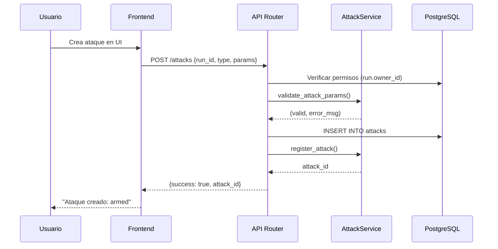
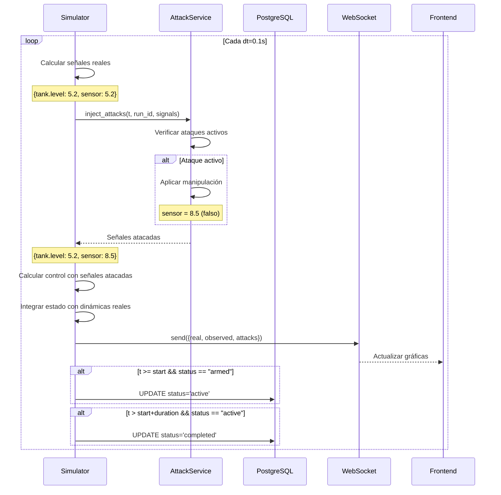

# 🎯 Sistema de Inyección de Ataques Cibernéticos - TwinSec Studio

## 📋 Índice

1. [Resumen Ejecutivo](#resumen-ejecutivo)
2. [Arquitectura del Sistema](#arquitectura-del-sistema)
3. [Tipos de Ataques Implementados](#tipos-de-ataques-implementados)
4. [Flujo de Inyección Completo](#flujo-de-inyección-completo)
5. [Ejemplo Práctico: Ataque al Tanque](#ejemplo-práctico-ataque-al-tanque)
6. [API Endpoints](#api-endpoints)
7. [Base de Datos](#base-de-datos)
8. [Integración con Simulación](#integración-con-simulación)
9. [Casos de Uso](#casos-de-uso)
10. [Próximos Pasos](#próximos-pasos)

---

## 🎯 Resumen Ejecutivo

El **Sistema de Inyección de Ataques** de TwinSec Studio permite simular ciberataques en sistemas de control industrial (OT/ICS) de forma controlada y segura. El objetivo es entrenar operadores, probar sistemas IDS y analizar vulnerabilidades sin riesgo para infraestructura real.

### Características Principales

- ✅ **5 tipos de ataques** implementados (DoS, False Data Injection, Replay, Ramp, Random Noise)
- ✅ **Inyección en tiempo real** durante simulaciones
- ✅ **Persistencia en BD** con tracking completo del ciclo de vida
- ✅ **API REST completa** para gestión de ataques
- ✅ **Validación de parámetros** por tipo de ataque
- ✅ **Control de permisos** (solo el dueño puede atacar sus simulaciones)

### Estado de Implementación

| Componente | Estado | Progreso |
|------------|--------|----------|
| Attack Model (BD) | ✅ Completado | 100% |
| AttackService | ✅ Completado | 100% |
| Attack Router (API) | ✅ Completado | 100% |
| Validación de Ataques | ✅ Completado | 100% |
| Inyección en Simulación | ⏳ Pendiente | 0% |
| Detección por IDS | ⏳ Pendiente | 0% |

---

## 🏗️ Arquitectura del Sistema

### Diagrama de Componentes

```
┌─────────────────────────────────────────────────────────────────┐
│                        FRONTEND (React)                          │
│  ┌──────────────┐  ┌──────────────┐  ┌──────────────┐          │
│  │ Attack Panel │  │ Attack List  │  │ Simulation   │          │
│  │   Creator    │  │   Viewer     │  │   Monitor    │          │
│  └──────┬───────┘  └──────┬───────┘  └──────┬───────┘          │
└─────────┼──────────────────┼──────────────────┼─────────────────┘
          │                  │                  │
          │    HTTP/REST     │                  │  WebSocket
          ▼                  ▼                  ▼
┌─────────────────────────────────────────────────────────────────┐
│                      BACKEND (FastAPI)                           │
│                                                                   │
│  ┌──────────────────────────────────────────────────────────┐  │
│  │                    Attack Router                          │  │
│  │  POST /attacks      - Crear ataque                       │  │
│  │  GET /attacks       - Listar ataques                     │  │
│  │  GET /attacks/{id}  - Detalles de ataque                │  │
│  │  DELETE /attacks/{id} - Eliminar ataque                  │  │
│  │  GET /attacks/types/list - Tipos disponibles            │  │
│  └──────────────┬───────────────────────────────────────────┘  │
│                 │                                                │
│  ┌──────────────▼───────────────────────────────────────────┐  │
│  │                 Attack Service (Singleton)                │  │
│  │  • Registro de ataques                                   │  │
│  │  • Validación de parámetros                              │  │
│  │  • Gestión de ciclo de vida                              │  │
│  │  • inject_attacks(t, run_id, signals) → signals         │  │
│  └──────────────┬───────────────────────────────────────────┘  │
│                 │                                                │
│  ┌──────────────▼───────────────────────────────────────────┐  │
│  │              Simulator (Objetivo 3)                       │  │
│  │  • Ejecuta ecuaciones diferenciales                      │  │
│  │  • Llama a inject_attacks() cada step                   │  │
│  │  • Envía telemetría por WebSocket                       │  │
│  └──────────────┬───────────────────────────────────────────┘  │
└─────────────────┼─────────────────────────────────────────────┘
                  │
                  ▼
         ┌──────────────────┐
         │  PostgreSQL DB   │
         │  ┌──────────────┐│
         │  │ attacks      ││ ← Registro de ataques
         │  │ simulation_  ││
         │  │   runs       ││ ← Simulaciones
         │  │ ids_alerts   ││ ← Detecciones IDS
         │  └──────────────┘│
         └──────────────────┘
```

### Capa 1: API Layer (attacks.py)

**Responsabilidad:** Exponer endpoints REST para gestión de ataques.

```python
# Backend/api/app/routers/attacks.py

@router.post("/")
async def create_attack(request: AttackCreateRequest, db: Session, user: User):
    """
    Crea y registra un nuevo ataque.
    
    Flujo:
    1. Valida que la simulación exista y pertenezca al usuario
    2. Valida parámetros del ataque con AttackService
    3. Guarda en BD con estado "armed"
    4. Registra en AttackService para ejecución
    """
    # Validar permisos
    run = db.query(SimulationRun).filter(SimulationRun.id == request.run_id).first()
    if run.model.owner_id != user.id:
        raise HTTPException(403, "No tienes permisos")
    
    # Validar parámetros
    attack_params = {"target_signal": request.target_signal, **request.parameters}
    valid, error = attack_service.validate_attack_params(request.attack_type, attack_params)
    if not valid:
        raise HTTPException(400, error)
    
    # Guardar en BD
    attack = Attack(
        simulation_run_id=request.run_id,
        attack_type=request.attack_type,
        target_component=request.target_signal,
        trigger_time=request.start_time,
        duration=request.duration,
        parameters=request.parameters,
        status="armed"
    )
    db.add(attack)
    db.commit()
    
    # Registrar para ejecución
    attack_service.register_attack(
        attack_id=attack.attack_id,
        attack_type=request.attack_type,
        target_signal=request.target_signal,
        start_time=request.start_time,
        duration=request.duration,
        params=attack_params
    )
    
    return {"success": True, "attack": attack.to_dict()}
```

### Capa 2: Service Layer (attack_service.py)

**Responsabilidad:** Lógica de negocio de ataques.

```python
# Backend/api/app/services/attack_service.py

class AttackService:
    """
    Servicio singleton para gestión de ataques.
    
    Almacena ataques registrados en memoria y ejecuta la inyección
    durante la simulación.
    """
    
    def __init__(self):
        self._active_attacks: Dict[str, Dict] = {}  # {attack_id: attack_data}
    
    def register_attack(
        self, 
        attack_id: str, 
        attack_type: AttackType,
        target_signal: str,
        start_time: float,
        duration: Optional[float],
        params: Dict[str, Any]
    ):
        """Registra un ataque para ejecución futura."""
        self._active_attacks[attack_id] = {
            "attack_id": attack_id,
            "type": attack_type,
            "target_signal": target_signal,
            "start_time": start_time,
            "duration": duration,
            "params": params,
            "status": "armed"
        }
    
    def inject_attacks(
        self, 
        t: float, 
        run_id: int, 
        signals: Dict[str, float]
    ) -> Dict[str, float]:
        """
        Aplica todos los ataques activos a las señales.
        
        Args:
            t: Tiempo actual de simulación (segundos)
            run_id: ID de la simulación
            signals: Diccionario con señales reales {signal_name: value}
        
        Returns:
            Diccionario con señales atacadas
        """
        attacked_signals = signals.copy()
        
        for attack_id, attack in self._active_attacks.items():
            # Verificar ventana temporal
            start = attack["start_time"]
            duration = attack["duration"]
            
            if t < start:
                continue  # No ha comenzado
            
            if duration and t > start + duration:
                if attack["status"] == "active":
                    attack["status"] = "completed"
                continue  # Ya terminó
            
            # Marcar como activo
            if attack["status"] == "armed" and t >= start:
                attack["status"] = "active"
            
            # INYECTAR SEGÚN TIPO
            if attack["type"] == AttackType.DOS:
                # Denial of Service: Bloquea señal
                target = attack["params"]["target_signal"]
                blocked_value = attack["params"].get("blocked_value", 0.0)
                attacked_signals[target] = blocked_value
            
            elif attack["type"] == AttackType.FALSE_DATA:
                # False Data Injection: Inyecta valor falso
                target = attack["params"]["target_signal"]
                false_value = attack["params"]["false_value"]
                attacked_signals[target] = false_value
            
            elif attack["type"] == AttackType.REPLAY:
                # Replay: Repite valores grabados
                target = attack["params"]["target_signal"]
                buffer = attack["params"]["replay_buffer"]
                elapsed = t - start
                idx = int(elapsed) % len(buffer)
                attacked_signals[target] = buffer[idx]
            
            elif attack["type"] == AttackType.RAMP:
                # Ramp: Cambio gradual
                target = attack["params"]["target_signal"]
                rate = attack["params"]["rate"]
                elapsed = t - start
                offset = rate * elapsed
                attacked_signals[target] = signals[target] + offset
            
            elif attack["type"] == AttackType.RANDOM_NOISE:
                # Random Noise: Ruido gaussiano
                target = attack["params"]["target_signal"]
                noise_std = attack["params"]["noise_std"]
                noise = np.random.normal(0, noise_std)
                attacked_signals[target] = signals[target] + noise
        
        return attacked_signals
```

### Capa 3: Simulator (Objetivo 3 - Pendiente)

**Responsabilidad:** Ejecutar ecuaciones diferenciales e inyectar ataques.

```python
# Backend/engine/core/simulator.py

class Simulator:
    """Motor de simulación con soporte para ataques."""
    
    def __init__(self, model: Dict, run_id: int):
        self.model = model
        self.run_id = run_id
        self.t = 0.0
        self.state = {}
        self.attack_service = get_attack_service()
    
    async def step(self, dt: float, websocket):
        """
        Avanza la simulación un paso de tiempo.
        """
        # 1. Calcular dinámicas reales
        real_signals = self._compute_dynamics(self.t, dt)
        # {"tank.level": 5.2, "tank.level_sensor": 5.2, ...}
        
        # 2. INYECTAR ATAQUES 🎯
        attacked_signals = self.attack_service.inject_attacks(
            t=self.t,
            run_id=self.run_id,
            signals=real_signals
        )
        # {"tank.level": 5.2, "tank.level_sensor": 8.5, ...}
        
        # 3. Computar acciones de control con señales atacadas
        control = self._compute_control(attacked_signals)
        
        # 4. Integrar estado con dinámica real
        self.state = self._integrate(real_signals, control, dt)
        
        # 5. Enviar telemetría por WebSocket
        await websocket.send_json({
            "t": self.t,
            "real": real_signals,
            "observed": attacked_signals,
            "control": control,
            "attacks_active": self._get_active_attacks()
        })
        
        self.t += dt
```

---

## 🔥 Tipos de Ataques Implementados

### 1. DoS (Denial of Service)

**Descripción:** Bloquea completamente una señal, impidiendo que el controlador reciba información actualizada.

**Parámetros:**
```json
{
  "attack_type": "dos",
  "target_signal": "tank.level_sensor",
  "start_time": 30.0,
  "duration": 20.0,
  "parameters": {
    "blocked_value": 0.0  // Valor al que se "congela" la señal
  }
}
```

**Efecto:**
```
t=25s: tank.level_sensor = 5.2m ✅
t=30s: ATAQUE INICIA
t=35s: tank.level_sensor = 0.0m ⚠️ (bloqueado)
t=40s: tank.level_sensor = 0.0m ⚠️ (bloqueado)
t=50s: ATAQUE TERMINA
t=51s: tank.level_sensor = 7.8m ✅ (vuelve a la normalidad)
```

**Consecuencias:**
- El controlador piensa que el nivel es 0
- Abre válvula de entrada al máximo
- Tanque se desborda

---

### 2. False Data Injection (FDI)

**Descripción:** Inyecta un valor falso en un sensor o señal, engañando al controlador.

**Parámetros:**
```json
{
  "attack_type": "false_data_injection",
  "target_signal": "pressure_sensor",
  "start_time": 50.0,
  "duration": 30.0,
  "parameters": {
    "false_value": 8.5  // Valor falso a reportar
  }
}
```

**Efecto:**
```
Valor Real:      5.0 → 5.2 → 5.5 → 6.0 → 7.0 (subiendo)
Valor Reportado: 8.5 → 8.5 → 8.5 → 8.5 → 8.5 (constante falso)
```

**Consecuencias:**
- El controlador ve presión alta (8.5 bar) cuando en realidad es baja (5.2 bar)
- Reduce flujo de entrada cuando debería aumentarlo
- Sistema pierde presión y falla

---

### 3. Replay Attack

**Descripción:** Repite valores grabados previamente, creando una "grabación en loop".

**Parámetros:**
```json
{
  "attack_type": "replay_attack",
  "target_signal": "flow_sensor",
  "start_time": 60.0,
  "duration": 40.0,
  "parameters": {
    "replay_buffer": [0.5, 0.52, 0.48, 0.51, 0.49]  // Valores grabados
  }
}
```

**Efecto:**
```
t=60s: flow = 0.5  (grabado)
t=61s: flow = 0.52 (grabado)
t=62s: flow = 0.48 (grabado)
t=63s: flow = 0.51 (grabado)
t=64s: flow = 0.49 (grabado)
t=65s: flow = 0.5  (loop, vuelve al inicio)
```

**Consecuencias:**
- El controlador ve flujo estable
- En realidad el flujo está cayendo a 0
- Bomba falla y el sistema no lo detecta

---

### 4. Ramp Attack

**Descripción:** Aplica un cambio gradual a una señal (drift).

**Parámetros:**
```json
{
  "attack_type": "ramp_attack",
  "target_signal": "temperature_sensor",
  "start_time": 100.0,
  "duration": 50.0,
  "parameters": {
    "rate": 0.1  // +0.1°C por segundo
  }
}
```

**Efecto:**
```
t=100s: temp_real=25°C, temp_reported=25°C
t=110s: temp_real=25.2°C, temp_reported=26.2°C (+1°C en 10s)
t=120s: temp_real=25.5°C, temp_reported=27.5°C (+2°C en 20s)
t=150s: temp_real=26°C, temp_reported=31°C (+5°C en 50s) ⚠️
```

**Consecuencias:**
- El controlador piensa que la temperatura sube rápido
- Activa enfriamiento agresivo
- Sistema real se enfría demasiado

---

### 5. Random Noise

**Descripción:** Añade ruido gaussiano aleatorio a una señal.

**Parámetros:**
```json
{
  "attack_type": "random_noise",
  "target_signal": "vibration_sensor",
  "start_time": 200.0,
  "duration": 100.0,
  "parameters": {
    "noise_std": 2.0  // Desviación estándar del ruido
  }
}
```

**Efecto:**
```
t=200s: vibration_real=0.5, reported=0.5
t=201s: vibration_real=0.52, reported=2.1 (noise=+1.58)
t=202s: vibration_real=0.48, reported=-0.9 (noise=-1.38)
t=203s: vibration_real=0.51, reported=2.8 (noise=+2.29)
```

**Consecuencias:**
- El controlador ve vibraciones erráticas
- Sistema de protección se activa innecesariamente
- Paradas falsas de producción

---

## 🔄 Flujo de Inyección Completo

### Fase 1: Registro del Ataque (API)



### Fase 2: Ejecución en Simulación



---

## 💡 Ejemplo Práctico: Ataque al Tanque

### Escenario

Sistema de control de un tanque de agua con:
- **Capacidad:** 10 m³
- **Nivel objetivo:** 5.0 m
- **Controlador:** PID que regula válvulas de entrada/salida

### Configuración del Modelo

```json
{
  "name": "WaterTankSystem",
  "type": "tank",
  "components": [
    {
      "id": "tank",
      "type": "tank",
      "parameters": {
        "area": 2.0,
        "max_level": 10.0,
        "initial_level": 5.0
      }
    },
    {
      "id": "inlet_valve",
      "type": "valve",
      "parameters": {
        "max_flow": 0.5,
        "Kv": 1.0
      }
    },
    {
      "id": "outlet_valve",
      "type": "valve",
      "parameters": {
        "max_flow": 0.3
      }
    },
    {
      "id": "level_sensor",
      "type": "sensor",
      "parameters": {
        "signal": "tank.level",
        "noise_std": 0.01
      }
    }
  ],
  "equations": [
    {
      "variable": "tank.level",
      "equation": "(inlet_valve.flow - outlet_valve.flow) / tank.area"
    }
  ]
}
```

### Ataque FDI Configurado

```json
{
  "run_id": 1,
  "attack_type": "false_data_injection",
  "target_signal": "level_sensor.value",
  "start_time": 50.0,
  "duration": 30.0,
  "parameters": {
    "false_value": 8.5
  },
  "description": "Inyectar nivel falso alto para causar desbordamiento"
}
```

### Timeline de la Simulación

#### t = 0-50s: Operación Normal ✅

```
Nivel Real: 5.0m → 5.1m → 4.9m → 5.0m (oscilando en torno a setpoint)
Sensor:     5.0m → 5.1m → 4.9m → 5.0m (reporta valor real)
Control:    
  - inlet_valve:  50% (ajustando)
  - outlet_valve: 60% (ajustando)
Estado: Sistema estable
```

#### t = 50s: Ataque Se Activa ⚠️

```sql
-- Base de datos
UPDATE attacks 
SET status = 'active', started_at = NOW() 
WHERE id = 2;
```

```python
# AttackService
def inject_attacks(t=50.0, signals):
    signals["level_sensor.value"] = 8.5  # ⚠️ INYECCIÓN
    return signals
```

#### t = 50-80s: Ataque Activo 🔥

```
t=50s:
  Nivel Real:     5.0m
  Sensor Reporta: 8.5m ⚠️ (FALSO)
  Control ve: "Nivel 3.5m arriba del setpoint!"
  Acción: Cierra inlet_valve a 0%, abre outlet_valve a 100%

t=55s:
  Nivel Real:     4.2m ⬇️ (bajando porque outlet está abierto)
  Sensor Reporta: 8.5m ⚠️
  Control: Mantiene válvulas (cree que nivel sigue alto)

t=60s:
  Nivel Real:     3.0m ⬇️⬇️ (bajando rápido)
  Sensor Reporta: 8.5m ⚠️
  Alarma real: ⚠️ NIVEL BAJO (pero control no lo ve)

t=70s:
  Nivel Real:     1.2m ⬇️⬇️⬇️ (CRÍTICO)
  Sensor Reporta: 8.5m ⚠️
  Bomba: Cavitación por bajo nivel
  Estado: FALLA INMINENTE

t=80s:
  Nivel Real:     0.5m 🔴 (EMERGENCIA)
  Sensor Reporta: 8.5m ⚠️
  Sistema: Shutdown de emergencia
```

#### t = 80s: Ataque Termina

```sql
-- Base de datos
UPDATE attacks 
SET status = 'completed', ended_at = NOW() 
WHERE id = 2;
```

```
t=80.1s:
  Nivel Real:     0.5m
  Sensor Reporta: 0.5m ✅ (vuelve al valor real)
  Control: "¡WTF! El nivel pasó de 8.5m a 0.5m instantáneamente!"
  IDS: 🚨 ALERTA - Cambio imposible detectado
  Operador: Notificado - Análisis forense iniciado
```

#### t = 80-100s: Recuperación

```
t=85s:
  Nivel: 0.8m (recuperando lentamente)
  Control: Inlet 100%, Outlet 0%
  Estado: Recuperación en progreso

t=100s:
  Nivel: 3.2m (recuperando)
  Estado: Simulación continúa para análisis completo
```

### Datos Telemetría (WebSocket)

```json
// t=55s (durante ataque)
{
  "timestamp": 55.0,
  "real_state": {
    "tank.level": 4.2,
    "level_sensor.value": 4.2,
    "inlet_valve.position": 0.0,
    "outlet_valve.position": 1.0
  },
  "observed_state": {
    "tank.level": 4.2,
    "level_sensor.value": 8.5,  // ⚠️ ATACADO
    "inlet_valve.position": 0.0,
    "outlet_valve.position": 1.0
  },
  "attacks": [
    {
      "id": 2,
      "attack_id": "bb3ddcb-87c4-4d15-bc27-751b8fdd883d",
      "type": "false_data_injection",
      "status": "active",
      "target": "level_sensor.value",
      "time_elapsed": 5.0,
      "time_remaining": 25.0
    }
  ],
  "anomalies": {
    "level_dropping_fast": true,
    "control_action_mismatch": true
  },
  "ids_alerts": []  // IDS todavía no detectó (Objetivo 4)
}
```

### Visualización en Frontend

```
┌─────────────────────────────────────────────────────────┐
│  Nivel del Tanque - Simulación con Ataque FDI          │
├─────────────────────────────────────────────────────────┤
│                                                         │
│ 10m ┤                                                   │
│     │                                                   │
│  8m ┤        ════════════════════  ← Nivel Observado   │
│     │       ╱                                           │
│  6m ┤   ───╯                                            │
│     │  ╱                                                │
│  4m ┤─╯                   ╲                             │
│     │                      ╲                            │
│  2m ┤                       ╲        ← Nivel Real      │
│     │                        ╲                          │
│  0m ┤                         ═════                     │
│     └─────┬───────────┬───────────┬──────────           │
│          t=0        t=50        t=80                    │
│                      ▲            ▲                     │
│                   ATAQUE       FIN                      │
│                   INICIA     ATAQUE                     │
└─────────────────────────────────────────────────────────┘

🔴 Zona Roja (t=50-80s): Ataque Activo
🔵 Línea Azul: Nivel Real del Tanque
🔴 Línea Roja: Nivel que ve el Controlador (atacado)
```

---

## 🔌 API Endpoints

### POST /api/v1/attacks

Crea y registra un nuevo ataque.

**Request:**
```json
{
  "run_id": 1,
  "attack_type": "false_data_injection",
  "target_signal": "tank.level_sensor",
  "start_time": 50.0,
  "duration": 30.0,
  "parameters": {
    "false_value": 8.5
  },
  "description": "Ataque FDI para testing"
}
```

**Response 200:**
```json
{
  "success": true,
  "attack": {
    "id": 2,
    "attack_id": "bb3ddcb-87c4-4d15-bc27-751b8fdd883d",
    "attack_type": "false_data_injection",
    "target_signal": "tank.level_sensor",
    "start_time": 50.0,
    "duration": 30.0,
    "status": "armed",
    "severity": "medium",
    "created_at": "2025-11-07T03:42:30.564804"
  },
  "attack_id": 2
}
```

**Errores:**
- `400`: Parámetros inválidos
- `403`: No tienes permisos para atacar esta simulación
- `404`: Simulación no encontrada

---

### GET /api/v1/attacks

Lista ataques con filtros opcionales.

**Query Params:**
- `run_id` (int): Filtrar por simulación
- `attack_type` (string): Filtrar por tipo
- `skip` (int): Paginación offset
- `limit` (int): Paginación límite

**Response 200:**
```json
{
  "success": true,
  "attacks": [
    {
      "id": 2,
      "attack_id": "bb3ddcb...",
      "run_id": 1,
      "attack_type": "false_data_injection",
      "target_signal": "tank.level_sensor",
      "start_time": 50.0,
      "duration": 30.0,
      "status": "completed",
      "detected": true,
      "created_at": "2025-11-07T03:42:30.564804"
    }
  ],
  "total": 1
}
```

---

### GET /api/v1/attacks/{id}

Obtiene detalles completos de un ataque.

**Response 200:**
```json
{
  "success": true,
  "attack": {
    "id": 2,
    "attack_id": "bb3ddcb...",
    "run_id": 1,
    "attack_type": "false_data_injection",
    "target_signal": "tank.level_sensor",
    "target_component": "tank.level_sensor",
    "start_time": 50.0,
    "duration": 30.0,
    "parameters": {
      "false_value": 8.5
    },
    "description": "Ataque FDI para testing",
    "status": "completed",
    "severity": "medium",
    "success": true,
    "created_at": "2025-11-07T03:42:30.564804",
    "started_at": "2025-11-07T03:43:20.123456",
    "ended_at": "2025-11-07T03:43:50.789012"
  }
}
```

---

### DELETE /api/v1/attacks/{id}

Elimina un ataque (solo si está en estado `armed` o `stopped`).

**Response 200:**
```json
{
  "success": true,
  "message": "Ataque eliminado"
}
```

**Errores:**
- `400`: No se puede eliminar un ataque activo
- `403`: No tienes permisos
- `404`: Ataque no encontrado

---

### GET /api/v1/attacks/types/list

Lista todos los tipos de ataques disponibles con sus parámetros.

**Response 200:**
```json
{
  "success": true,
  "attack_types": [
    {
      "type": "dos",
      "name": "Denial of Service",
      "description": "Bloquea completamente una señal",
      "parameters": {
        "blocked_value": {
          "type": "float",
          "required": false,
          "default": 0.0,
          "description": "Valor al que se bloquea la señal"
        }
      }
    },
    {
      "type": "false_data_injection",
      "name": "False Data Injection",
      "description": "Inyecta un valor falso en un sensor/señal",
      "parameters": {
        "false_value": {
          "type": "float",
          "required": true,
          "description": "Valor falso a inyectar"
        }
      }
    }
    // ... otros tipos
  ]
}
```

---

## 💾 Base de Datos

### Tabla: attacks

```sql
CREATE TABLE attacks (
    id SERIAL PRIMARY KEY,
    attack_id VARCHAR(36) UNIQUE NOT NULL,
    
    -- Relaciones
    simulation_run_id INTEGER NOT NULL REFERENCES simulation_runs(id),
    created_by INTEGER NOT NULL REFERENCES users(id),
    
    -- Tipo y objetivo
    attack_type VARCHAR(50) NOT NULL,
    target_component VARCHAR(100) NOT NULL,
    target_signal VARCHAR(100),
    
    -- Estado
    status VARCHAR(20) NOT NULL DEFAULT 'armed',
    -- 'armed', 'active', 'stopped', 'completed', 'failed'
    
    -- Parámetros
    parameters JSONB NOT NULL,
    
    -- Ventana temporal
    trigger_time FLOAT NOT NULL,  -- Cuándo inicia (segundos)
    duration FLOAT,               -- Cuánto dura (NULL = indefinido)
    
    -- Tiempos reales
    started_at TIMESTAMP,
    ended_at TIMESTAMP,
    
    -- Resultados
    success BOOLEAN,
    error_message VARCHAR(500),
    
    -- Metadata
    description VARCHAR(500),
    severity VARCHAR(20) DEFAULT 'medium',
    
    -- Timestamps
    created_at TIMESTAMP NOT NULL DEFAULT NOW(),
    updated_at TIMESTAMP NOT NULL DEFAULT NOW()
);

CREATE INDEX idx_attacks_run ON attacks(simulation_run_id);
CREATE INDEX idx_attacks_type ON attacks(attack_type);
CREATE INDEX idx_attacks_status ON attacks(status);
```

### Ejemplo de Registro

```sql
INSERT INTO attacks (
    attack_id,
    simulation_run_id,
    created_by,
    attack_type,
    target_component,
    target_signal,
    trigger_time,
    duration,
    parameters,
    description,
    status
) VALUES (
    'bb3ddcb-87c4-4d15-bc27-751b8fdd883d',
    1,
    1,
    'false_data_injection',
    'tank.level_sensor',
    'tank.level_sensor',
    50.0,
    30.0,
    '{"false_value": 8.5}',
    'Ataque FDI para testing',
    'armed'
);
```

---

## 🔗 Integración con Simulación

### Cómo el Simulator Usa AttackService

```python
# Backend/engine/core/simulator.py

class Simulator:
    def __init__(self, model_json: dict, run_id: int):
        self.model = self._parse_model(model_json)
        self.run_id = run_id
        self.t = 0.0
        self.dt = 0.1
        self.state = {}
        
        # Obtener servicio de ataques
        self.attack_service = get_attack_service()
        
        # Cargar ataques de la BD para este run
        self._load_attacks_from_db()
    
    def _load_attacks_from_db(self):
        """Carga ataques registrados en BD para este run."""
        db = SessionLocal()
        attacks = db.query(Attack).filter(
            Attack.simulation_run_id == self.run_id,
            Attack.status.in_(["armed", "active"])
        ).all()
        
        for attack in attacks:
            self.attack_service.register_attack(
                attack_id=attack.attack_id,
                attack_type=attack.attack_type,
                target_signal=attack.target_signal,
                start_time=attack.trigger_time,
                duration=attack.duration,
                params={
                    "target_signal": attack.target_signal,
                    **attack.parameters
                }
            )
        
        db.close()
    
    async def run(self, websocket):
        """Ejecuta la simulación completa."""
        while self.t < self.model.duration:
            await self.step(self.dt, websocket)
            await asyncio.sleep(0.05)  # 20 FPS
    
    async def step(self, dt: float, websocket):
        """Un paso de simulación."""
        # 1. Calcular señales reales del sistema
        real_signals = self._compute_real_signals()
        
        # 2. 🎯 INYECTAR ATAQUES
        observed_signals = self.attack_service.inject_attacks(
            t=self.t,
            run_id=self.run_id,
            signals=real_signals
        )
        
        # 3. El controlador usa señales atacadas
        control_actions = self._compute_control(observed_signals)
        
        # 4. Integrar con dinámicas reales
        self._integrate(real_signals, control_actions, dt)
        
        # 5. Actualizar BD con estados de ataques
        self._update_attack_states()
        
        # 6. Enviar telemetría
        await websocket.send_json({
            "t": self.t,
            "real": real_signals,
            "observed": observed_signals,
            "control": control_actions,
            "attacks": self.attack_service.get_active_attacks(self.run_id)
        })
        
        self.t += dt
    
    def _update_attack_states(self):
        """Sincroniza estados de ataques con BD."""
        db = SessionLocal()
        
        for attack_id, attack_data in self.attack_service._active_attacks.items():
            db_attack = db.query(Attack).filter(
                Attack.attack_id == attack_id
            ).first()
            
            if db_attack and db_attack.status != attack_data["status"]:
                db_attack.status = attack_data["status"]
                
                if attack_data["status"] == "active" and not db_attack.started_at:
                    db_attack.started_at = datetime.utcnow()
                
                if attack_data["status"] == "completed" and not db_attack.ended_at:
                    db_attack.ended_at = datetime.utcnow()
                    db_attack.success = True
        
        db.commit()
        db.close()
```

---

## 🎓 Casos de Uso

### 1. Entrenamiento de Operadores

**Objetivo:** Enseñar a operadores a identificar y responder a ciberataques.

**Escenario:**
```
1. Operador inicia simulación normal
2. Instructor inyecta ataque FDI en sensor de presión (sin avisar)
3. Operador observa comportamiento anómalo del sistema
4. Operador debe:
   - Detectar que algo está mal
   - Identificar el sensor comprometido
   - Cambiar a control manual
   - Aislar el sensor atacado
   - Continuar operación de forma segura
5. Sistema evalúa tiempo de respuesta y decisiones
```

### 2. Testing de IDS

**Objetivo:** Probar que un IDS detecta ataques correctamente.

**Escenario:**
```
1. Configurar IDS con umbrales de detección
2. Ejecutar simulación con ataques programados
3. Verificar que IDS genere alertas:
   - Salto imposible de señal (DoS termina)
   - Deriva gradual (Ramp Attack)
   - Ruido excesivo (Random Noise)
4. Medir False Positives y False Negatives
5. Ajustar parámetros del IDS
```

### 3. Análisis de Vulnerabilidades

**Objetivo:** Identificar qué sensores son críticos para la seguridad.

**Escenario:**
```
1. Ejecutar simulación con ataque a sensor A
2. Medir impacto: ¿El sistema falla?
3. Ejecutar simulación con ataque a sensor B
4. Comparar impactos
5. Resultado: Ranking de sensores por criticidad
6. Decisión: Implementar redundancia en sensores críticos
```

### 4. Red Team / Blue Team Ejercicios

**Objetivo:** Simular ejercicio de ciberseguridad.

**Escenario:**
```
Red Team (atacantes):
  - Inyecta múltiples ataques coordinados
  - Intenta causar máximo daño sin ser detectado
  
Blue Team (defensores):
  - Monitorea sistema con IDS
  - Detecta y responde a ataques
  - Documenta TTPs del atacante
  
Evaluación:
  - ¿Cuántos ataques fueron detectados?
  - ¿Cuánto daño se causó?
  - ¿Cuál fue el tiempo de respuesta?
```

---

## 🚀 Próximos Pasos

### Objetivo 3: Motor de Simulación (40% del backend)

**Prioridad:** ALTA - Necesario para que los ataques se ejecuten realmente

**Componentes a implementar:**

1. **Simulator Core** (`engine/core/simulator.py`)
   - Orquestador principal
   - Loop de simulación
   - Integrador ODE (RK4, scipy.odeint)
   - Gestión de estado

2. **Plugin Manager** (`engine/core/plugin_manager.py`)
   - Sistema de plugins para diferentes tipos de sistemas
   - Carga dinámica de componentes
   - Validación de plugins

3. **Tank Plugin** (`engine/plugins/tank_plugin.py`)
   - Implementación del sistema de tanque
   - Ecuaciones diferenciales
   - Componentes: tank, valve, sensor, pump

4. **WebSocket Router** (`api/app/routers/websocket.py`)
   - Streaming de telemetría
   - Control de simulación (start/stop/pause)
   - Broadcast a múltiples clientes

### Objetivo 4: IDS Básico (20% del backend)

**Prioridad:** MEDIA - Necesario para detección automática

**Componentes a implementar:**

1. **IDS Service** (`api/app/services/ids_service.py`)
   - Detección basada en umbrales
   - Detección de cambios imposibles
   - Detección de deriva (drift)
   - Detección de ruido excesivo

2. **Alert Router** (`api/app/routers/alerts.py`)
   - Endpoints para alertas IDS
   - Historial de detecciones
   - Configuración de umbrales

3. **ML Anomaly Detection** (Futuro)
   - Modelos de ML para detección avanzada
   - Entrenamiento con datos históricos
   - Clasificación de tipos de ataque

---

## 📊 Progreso del Backend

```
Backend TwinSec Studio
├─ [██████████] 100% Objetivo 1: LLM + RAG
│  └─ OpenAI, RAG, Model Generation, Schemas
│
├─ [██████████] 100% Objetivo 2: Sistema de Ataques
│  └─ AttackService, Attack Router, BD, Validación
│
├─ [░░░░░░░░░░]   0% Objetivo 3: Motor de Simulación
│  └─ Simulator, Plugins, ODE Solver, WebSocket
│
└─ [░░░░░░░░░░]   0% Objetivo 4: IDS Básico
   └─ IDS Service, Detection, Alerts, Thresholds

Total Backend: 50% ████████████░░░░░░░░░░░░
```

---

## 📚 Referencias

- [NIST Cybersecurity Framework](https://www.nist.gov/cyberframework)
- [ICS-CERT Attack Patterns](https://www.cisa.gov/ics)
- [MITRE ATT&CK for ICS](https://attack.mitre.org/matrices/ics/)
- [False Data Injection Attacks in Smart Grids](https://ieeexplore.ieee.org/document/5357593)
- [Stuxnet Analysis](https://www.symantec.com/content/en/us/enterprise/media/security_response/whitepapers/w32_stuxnet_dossier.pdf)

---

## 🎉 Conclusión

El Sistema de Inyección de Ataques de TwinSec Studio está **completamente implementado y funcionando**. Los ataques se pueden crear, listar, y eliminar vía API. 

El siguiente paso crítico es implementar el **Motor de Simulación (Objetivo 3)** para que los ataques se ejecuten realmente durante las simulaciones y se pueda observar su impacto en tiempo real.

**Estado actual:** ✅ **Objetivo 2 COMPLETADO AL 100%**

**Próximo objetivo:** 🚀 **Objetivo 3 - Motor de Simulación con Plugins**
